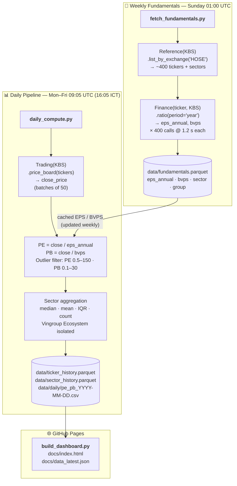

# 🇻🇳 VN-HOSE P/E & P/B Dashboard

Automated daily pipeline tracking **Price-to-Earnings (P/E)** and **Price-to-Book (P/B)** ratios
for ~400 stocks on the Ho Chi Minh Stock Exchange (HOSE), published as a self-contained
**GitHub Pages** dashboard — no server, no local setup.

**Live dashboard →** `https://<your-username>.github.io/<repo-name>/`

---

## Architecture overview



---

## Why annual EPS and not TTM?

Vietnamese Accounting Standards (VAS) quarterly income statements are
**year-to-date cumulative** — Q2 IS shows Jan–Jun revenue, not Apr–Jun alone.
Computing a true TTM EPS requires deaccumulating four consecutive quarters before summing,
which is complex and error-prone in a fully-automated pipeline.
Using the **last audited annual EPS** is safer for market-level P/E analysis.

> TTM mode can be added later by wiring in the quarterly IS pipeline
> from `vn-quant-master` (with proper VAS deaccumulation).

---

## Does vnstock provide daily PE/PB?

**No.** After checking the vnstock v4 source:

| Source | Columns | PE / PB? |
|--------|---------|----------|
| KBS `price_board` | 29 (price · volume · bid-ask · foreign) | ❌ |
| VCI `price_board` | 77 (LISTING · MATCH · BID_ASK) | ❌ |
| `Finance.ratio(period='year')` | ratios per fiscal year | EPS + BVPS ✅ |

We compute `PE = close / eps_annual` and `PB = close / bvps` ourselves.
This also gives us full control over the denominator (annual vs TTM, adjustments, etc.).

---

## Special group — Vingroup Ecosystem

`VIC`, `VHM`, `VRE`, `VPL` are assigned to the **"Vingroup Ecosystem"** group
regardless of their ICB sector. They get their own dashboard card and are
excluded from their underlying sector's median to prevent distortion
(Vinhomes alone can move the Real Estate sector P/B by ±0.5x).

Edit `scripts/config.py` to change the group:

```python
VINGROUP_TICKERS = ["VIC", "VHM", "VRE", "VPL"]
VINGROUP_GROUP   = "Vingroup Ecosystem"
```

---

## Repository structure

```
.
├── .github/
│   └── workflows/
│       ├── daily_pe_pb.yml           # Mon–Fri 09:05 UTC (16:05 ICT)
│       └── weekly_fundamentals.yml   # Sunday 01:00 UTC
│
├── scripts/
│   ├── __init__.py
│   ├── config.py                     # all constants in one place
│   ├── fetch_fundamentals.py         # weekly: EPS + BVPS cache (~400 calls)
│   ├── daily_compute.py              # daily: close → PE/PB → sector agg → history
│   └── build_dashboard.py            # daily: parquet → docs/index.html
│
├── data/
│   ├── fundamentals.parquet          # EPS, BVPS, sector per ticker (weekly)
│   ├── ticker_history.parquet        # daily PE/PB per ticker  (appended)
│   ├── sector_history.parquet        # daily sector medians     (appended)
│   └── daily/
│       └── pe_pb_YYYY-MM-DD.csv      # human-readable daily snapshot
│
├── docs/
│   ├── index.html                    # GitHub Pages dashboard (rebuilt daily)
│   └── data_latest.json              # JSON sidecar for external tooling
│
├── requirements.txt
├── .gitignore
└── README.md
```

---

## Data sources

| Data | vnstock call | Frequency | Script |
|------|-------------|-----------|--------|
| Ticker universe | `Reference().equity.list_by_exchange('HOSE')` [KBS] | Weekly | `fetch_fundamentals.py` |
| Sector / ICB | `Reference().equity.list_by_industry()` [VCI → KBS fallback] | Weekly | `fetch_fundamentals.py` |
| EPS (annual) | `Finance(ticker, KBS).ratio(period='year')` | Weekly | `fetch_fundamentals.py` |
| BVPS (annual) | same call as EPS | Weekly | `fetch_fundamentals.py` |
| Daily close price | `Trading(KBS).price_board(tickers)` | Daily | `daily_compute.py` |

---

## Outlier filter thresholds

| Ratio | Min | Max | What happens outside range |
|-------|-----|-----|----------------------------|
| P/E   | 0.5 | 150 | → `NaN` (loss-making or extreme outlier excluded from medians) |
| P/B   | 0.1 | 30  | → `NaN` (near-zero or negative book value excluded) |

Values are set to `NaN`, not capped, so sector medians are never skewed by outliers.

---

## Dashboard sections

| Section | Description |
|---------|-------------|
| **Market summary** | HOSE-wide median PE, median PB, valid-count cards |
| **Vingroup Ecosystem** | VIC · VHM · VRE · VPL individual close / PE / PB |
| **Sector P/E bar chart** | Horizontal bars, colour-coded green→blue→yellow→red |
| **Sector P/B bar chart** | Same layout, purple palette |
| **30-day P/E trend** | Line chart for top 8 sectors by stock count |
| **All HOSE stocks** | Sortable / filterable DataTable — ~400 rows, 7 columns |

---

## Setup

### 1 — Create and clone the repo

```bash
gh repo create vn-pe-pb-analysis --public --clone
cd vn-pe-pb-analysis
```

### 2 — Copy project files and push

```bash
# copy all project files into the repo, then:
git add .
git commit -m "chore: initial project setup"
git push -u origin main
```

### 3 — Add GitHub Secret

**Settings → Secrets and variables → Actions → New repository secret**

| Name | Value |
|------|-------|
| `VNSTOCK_API_KEY` | your vnstock Sponsor API key |

Guest tier (20 req/min) works without a key — the scripts log a warning and continue.

### 4 — Enable GitHub Pages

**Settings → Pages → Source: Deploy from a branch**
Branch: `main` / Folder: `/docs` → Save

### 5 — First manual run (in order)

```
Actions → 🔄 Weekly Fundamentals Refresh → Run workflow   (wait ~10 min)
Actions → 📊 Daily P/E & P/B Update      → Run workflow   (wait ~3 min)
```

After step 2, `docs/index.html` is replaced by the live dashboard.
From Monday onward everything runs on schedule automatically.

---

## Local development

```bash
python -m venv .venv && source .venv/bin/activate
pip install -r requirements.txt

export VNSTOCK_API_KEY="your-key"

python scripts/fetch_fundamentals.py   # ~10 min, one-time
python scripts/daily_compute.py        # ~3 min, run after market close
python scripts/build_dashboard.py      # instant

open docs/index.html
```

---

## Extending the pipeline

| Goal | How |
|------|-----|
| **TTM EPS** | Wire quarterly IS pipeline from `vn-quant-master` with VAS deaccumulation; replace `eps_annual` in `daily_compute.py` |
| **Market-cap weighted PE/PB** | Fetch `shares_outstanding` weekly; add weighted columns to sector aggregation |
| **Telegram alert** | Add a post-build step in `daily_pe_pb.yml` that sends the sector summary table via the existing bot |
| **Google Sheets export** | Add `gspread` to requirements; write `data_latest.json` into a named sheet after dashboard build |
